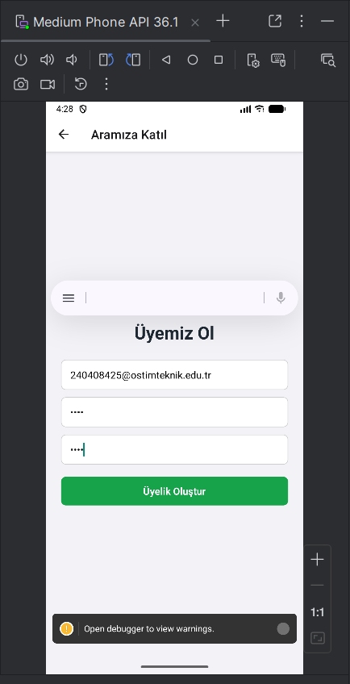
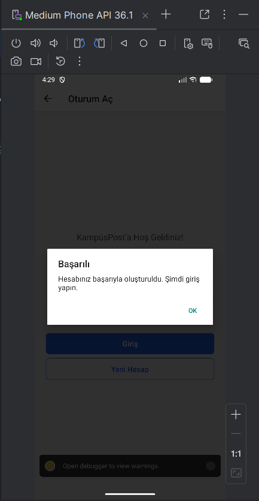
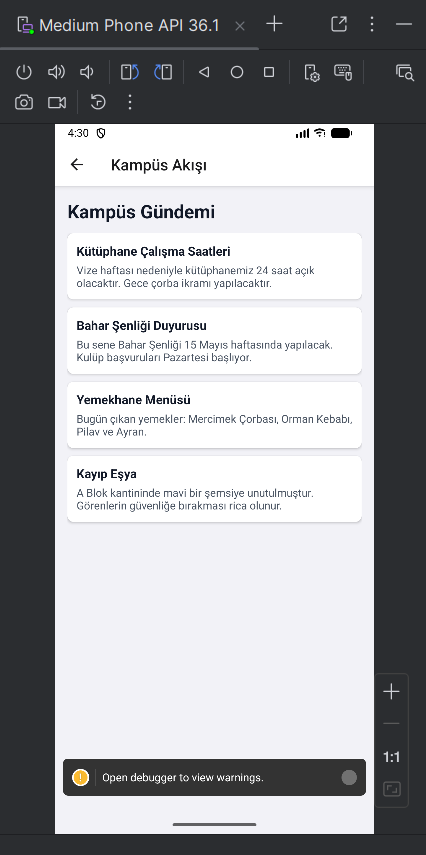
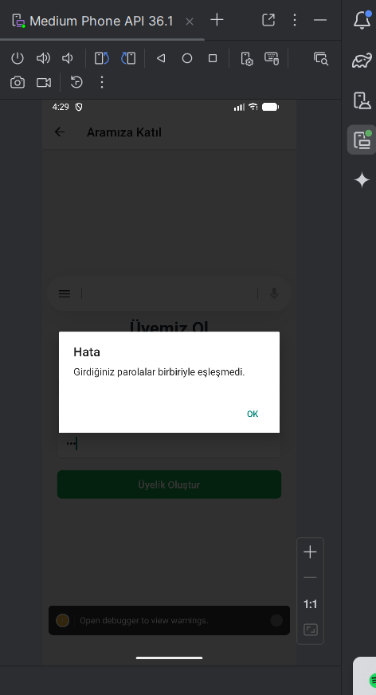
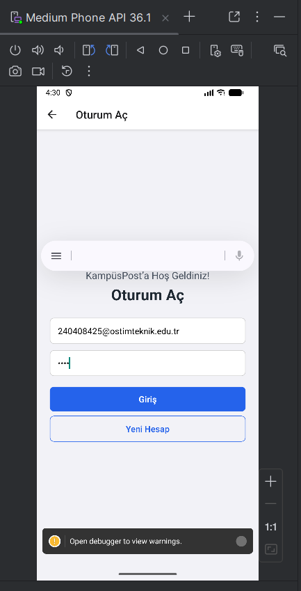
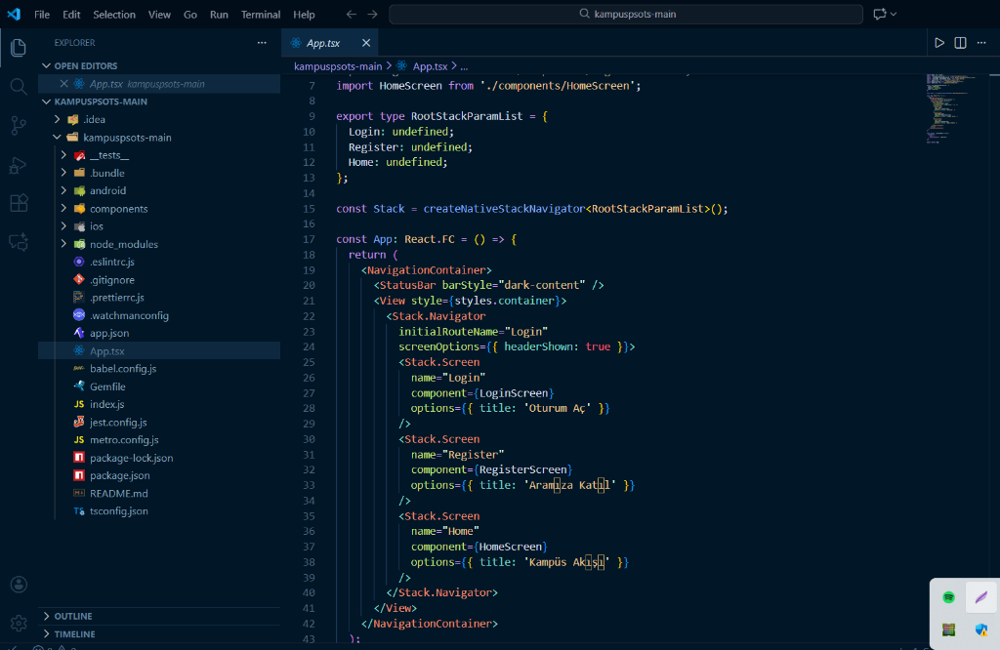
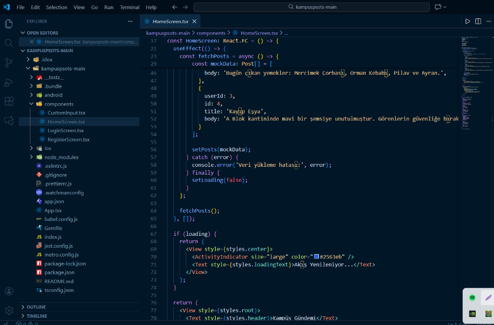
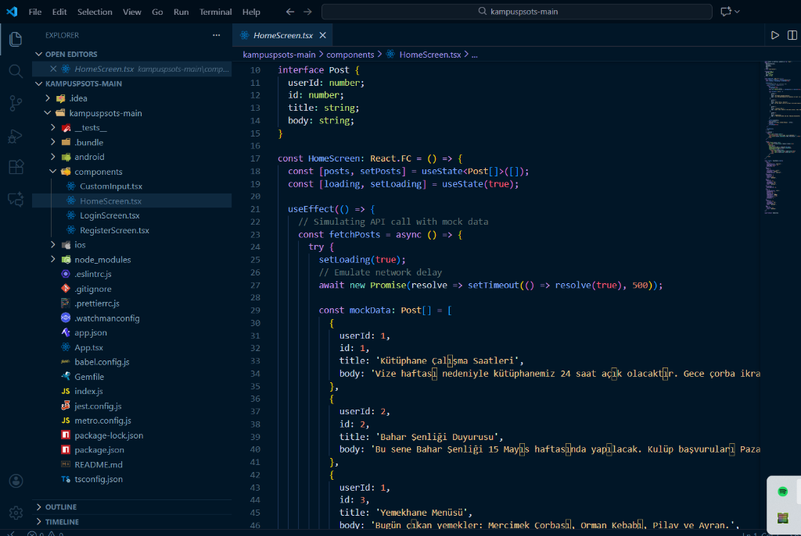

## KampüsPost – React Native Projesi
Görseller:

<p float="left">
  
  
  
  
  
  
  
  
</p>
Bu proje, React Native kullanılarak geliştirilmiş, üniversite öğrencilerini bir araya getiren **KampüsPost** uygulaması iskeletidir.  
Ödev kapsamında şu özellikler uygulanmıştır:

- **Giriş ekranı (`LoginScreen`)** – Öğrenci E-postası, parola alanları ve “Giriş / Yeni Hesap” butonları
- **Kayıt ekranı (`RegisterScreen`)** – E-posta, parola, parola doğrulama ve kullanıcı oluşturma
- **Kampüs Akışı (`HomeScreen`)** – Üniversite duyurularını ve etkinliklerini listeleme (Mock Data ile simüle edilmiştir)
- **React Navigation** ile **Stack Navigator** yapısı
- **Yeniden kullanılabilir `CustomInput` bileşeni**

## Projeyi Çalıştırma

Terminalde proje klasörüne girin:

```sh
cd KampusPost2-main
```

Metro (React Native dev server) başlatın:

```sh
npm start
```

Yeni bir terminal penceresinde Android emülatörü veya cihaz üzerinde uygulamayı çalıştırın:

```sh
npm run android
```

> iOS için ek kurulumlar (macOS, Xcode, CocoaPods) gerektiğinden bu projede ana odak Android tarafıdır.

## Ekranlar ve Navigasyon

- **NavigationContainer + Stack Navigator**  
  `App.tsx` içinde `NavigationContainer` ve `createNativeStackNavigator` ile şu ekranlar tanımlıdır:
  - `Login` → `LoginScreen`
  - `Register` → `RegisterScreen`
  - `Home` → `HomeScreen`  
  Açılış ekranı **LoginScreen**’dir (`initialRouteName="Login"`).

- **LoginScreen**  
  - Üst yazı: **“KampüsPost’a Hoş Geldiniz!”**  
  - Başlık: **“Oturum Aç”**  
  - Alanlar: Öğrenci E-postası, Gizli Parola (`CustomInput` bileşeni ile)  
  - Butonlar:
    - **“Giriş”** → şimdilik doğrulama yapmadan **Kampüs Akışı**’na yönlendirir.
    - **“Yeni Hesap”** → **RegisterScreen**’e yönlendirir.

- **RegisterScreen**  
  - Alanlar: E-posta, Şifre, Parola Doğrulama.  
  - **“Üyelik Oluştur”** butonu:
    - Şifreler uyuşmazsa: `Alert.alert("Hata", "Girdiğiniz parolalar birbiriyle eşleşmedi.")`
    - Şifreler aynıysa:
      - `console.log("Kayıt başarılı", { email })`
      - `Alert.alert("Başarılı", "Hesabınız başarıyla oluşturuldu. Şimdi giriş yapın.")`
      - Ardından **LoginScreen**’e geri yönlendirir.

- **HomeScreen (Kampüs Akışı)**  
  - Simüle edilmiş bir API çağrısı ile (`setTimeout` kullanılarak) kampüs duyurularını listeler.
  - Veriler **Kütüphane Çalışma Saatleri**, **Bahar Şenliği**, **Yemekhane Menüsü** gibi gerçekçi senaryolar içerir.
  - `FlatList` ile her duyuru listelenir.
  - Veri yüklenirken:
    - Ortada spinner ve **“Akış Yenileniyor…”** metni görünür.

## Proje Klasör Yapısı

```
KampusPost/
├── App.tsx                    # Ana uygulama dosyası (NavigationContainer + Stack Navigator)
├── index.js                   # React Native giriş noktası
├── app.json                   # Expo/React Native yapılandırma dosyası
├── package.json               # NPM bağımlılıkları ve scriptler
├── package-lock.json          # NPM kilit dosyası
├── tsconfig.json              # TypeScript yapılandırması
├── babel.config.js            # Babel yapılandırması
├── metro.config.js            # Metro bundler yapılandırması
├── jest.config.js             # Jest test yapılandırması
├── Gemfile                    # Ruby bağımlılıkları (iOS için)
├── .gitignore                 # Git ignore kuralları
├── README.md                  # Proje dokümantasyonu
│
├── components/                # React Native bileşenleri
│   ├── CustomInput.tsx        # Yeniden kullanılabilir input bileşeni
│   ├── LoginScreen.tsx        # Giriş ekranı (form + butonlar)
│   ├── RegisterScreen.tsx     # Kayıt ekranı (şifre kontrolü + yönlendirme)
│   └── HomeScreen.tsx         # Ana ekran (Mock Data + FlatList)
│
├── __tests__/                 # Test dosyaları
│   └── App.test.tsx           # App bileşeni testleri
│
├── android/                   # Android platform dosyaları
└── ios/                       # iOS platform dosyaları
```

## Teslim İçin Notlar

- **Özelleştirme**: Uygulama standart bir iskeletten alınarak, üniversite sosyal ağı konseptine uygun şekilde özelleştirilmiştir. 
- **Veri Kaynağı**: `jsonplaceholder` yerine, senaryoya uygun yerel veri seti kullanılmıştır.
